<div align="center">

# Finance Ledger API

### Prove your finance data wasn't quietly changed.

A role-based finance backend where every change goes into a **hash-chained audit ledger**.<br>
Edit the database behind its back and one call names the exact row you touched.

[](https://github.com/KUNALSHAWW/Finance-Data-Processing-and-Access-Control-Backend/actions/workflows/ci.yml)


[](LICENSE)

**[Live demo](https://finance-ledger-vwed.onrender.com)** &nbsp;·&nbsp; **[Swagger API docs](https://finance-ledger-api-aqso.onrender.com/swagger-ui/index.html)** &nbsp;·&nbsp; **[How it works](#how-it-works)** &nbsp;·&nbsp; **[Run it locally](#run-it-locally)**

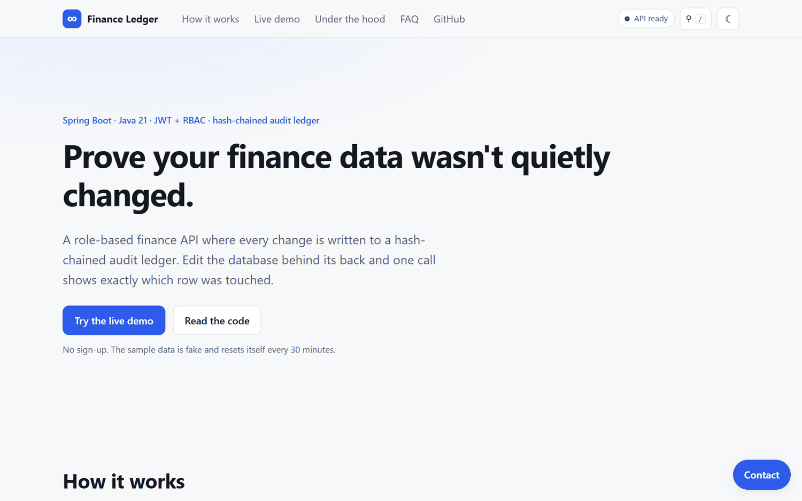

</div>

## The problem

Finance systems keep audit logs, but an audit log is usually just another table, and anyone with database access can edit the log and the data together. When a number is questioned later, nobody can *prove* it was never altered.

## The idea

Every change to a record or a user is written to an append-only ledger **in the same transaction as the change**. Each ledger entry stores the hash of the one before it, plus a digest of the row's new state. So:

- editing or deleting a ledger entry breaks the chain at that entry, and
- editing a business row directly in the database (skipping the API) no longer matches the last digest the API wrote.

`GET /api/audit/verify` recomputes the chain and compares every live row, then reports exactly what no longer matches.

<div align="center">
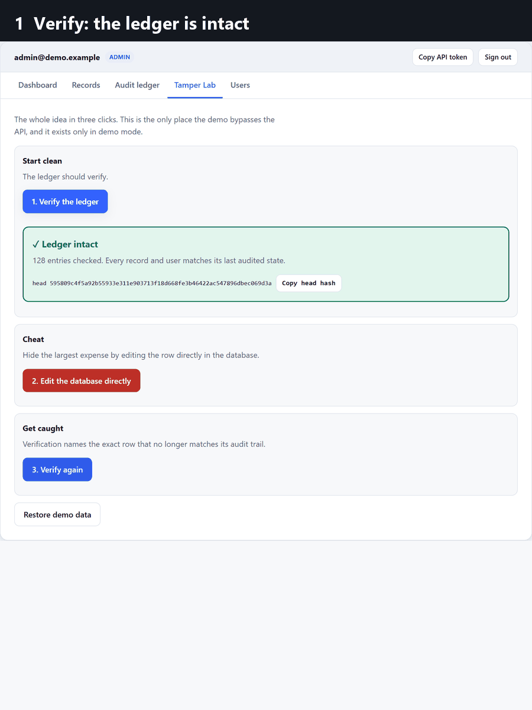
<br><sub>The whole idea in three clicks, recorded from the live site.</sub>
</div>

## Try it in 30 seconds

1. Open the **[live demo](https://finance-ledger-vwed.onrender.com)** and click **Enter as Admin** (no sign-up).
2. Open the **Tamper Lab** tab and click **Verify the ledger**: green.
3. Click **Edit the database directly** (a confirmation modal explains what it does). It runs a raw SQL `UPDATE` that hides the largest expense.
4. Click **Verify again**: red, naming the exact record.

The API runs on free hosting that sleeps after 15 minutes idle. The page wakes it as soon as you arrive (the chip in the header shows progress), usually well under a minute. Sample data is synthetic, public by design, and resets every 30 minutes.

## What you get

| | |
|---|---|
| **Tamper-evident ledger** | Hash chain + per-row digests. Detects edited or removed log entries, rows changed with raw SQL, users promoted in the database, rows inserted or deleted behind the API. |
| **Explainable anomaly insights** | Modified z-score on median/MAD per category. Every flag says why. |
| **Real access control** | JWT + BCrypt, three roles, lockout after 5 failures, roles re-read from the database on every request so deactivation is immediate. Every cell of the role matrix is a test. |
| **Correct money** | `BigDecimal` / `DECIMAL(19,2)`, validated amounts, totals computed by the database with `GROUP BY`, optimistic locking on edits. |
| **A web console** | Role-based dashboard, records, audit viewer and Tamper Lab. Dark mode, site search (`/`), mobile menu, confirmation modals, loading and error states, copy buttons, print stylesheet, keyboard-friendly. |
| **Shippable** | Flyway migrations, Dockerfile, Docker Compose with MySQL 8, CI on every push, Swagger, Postman collection. |

<table>
<tr>
<td width="50%">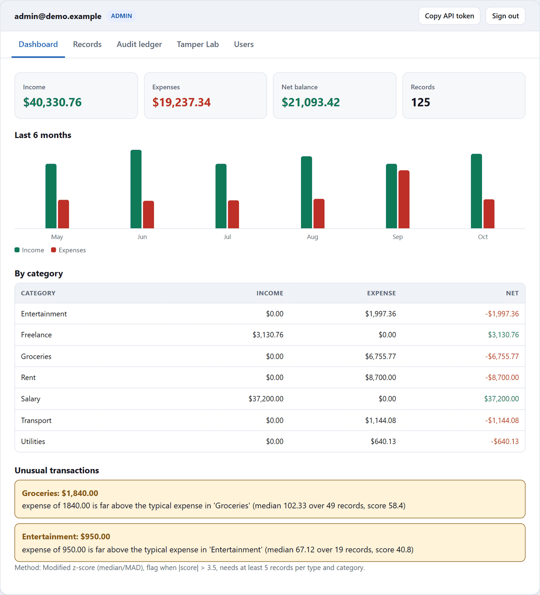<br><sub><b>Dashboard.</b> Totals, trend, categories, and the two planted anomalies with their reasons.</sub></td>
<td width="50%">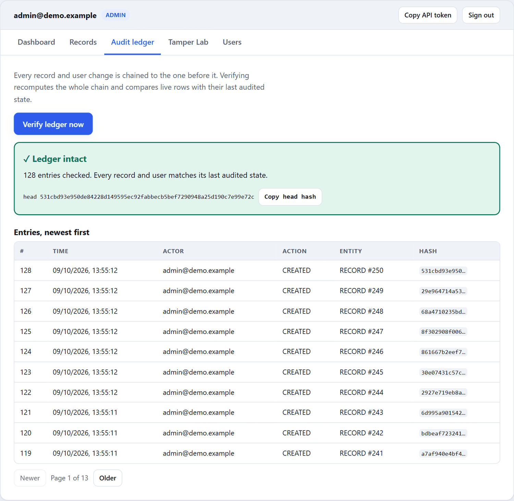<br><sub><b>Audit ledger.</b> Verify on demand; entries show actor, action, entity and hash.</sub></td>
</tr>
<tr>
<td>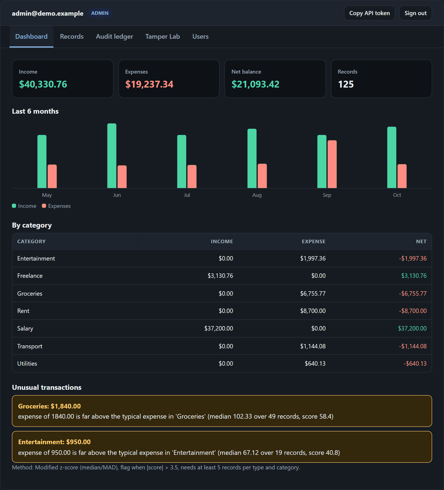<br><sub><b>Dark mode</b> follows the OS setting and can be toggled.</sub></td>
<td>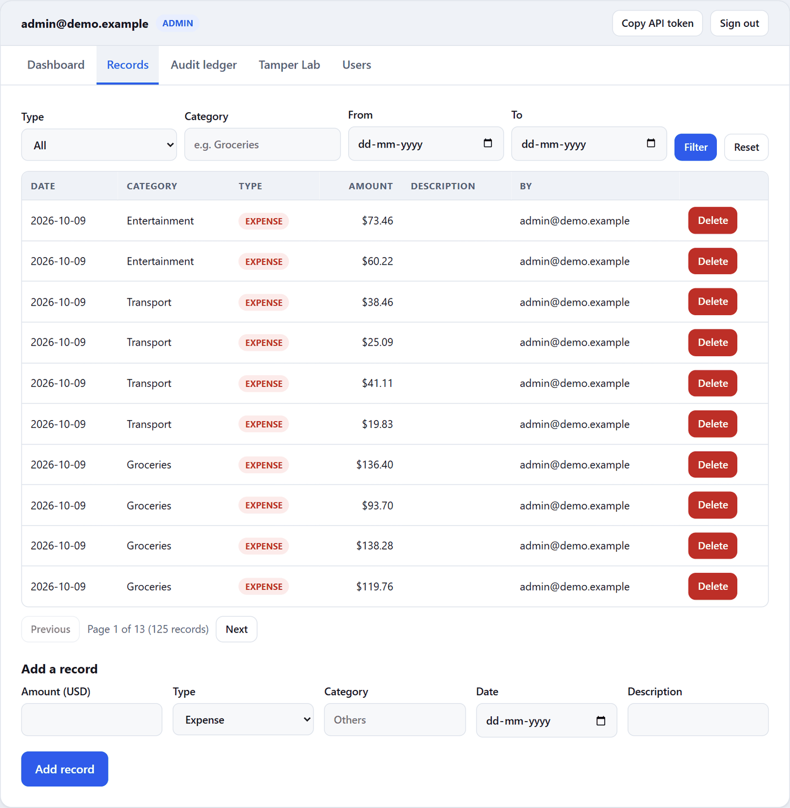<br><sub><b>Records.</b> Filters, pagination, and an add form with inline validation.</sub></td>
</tr>
<tr>
<td>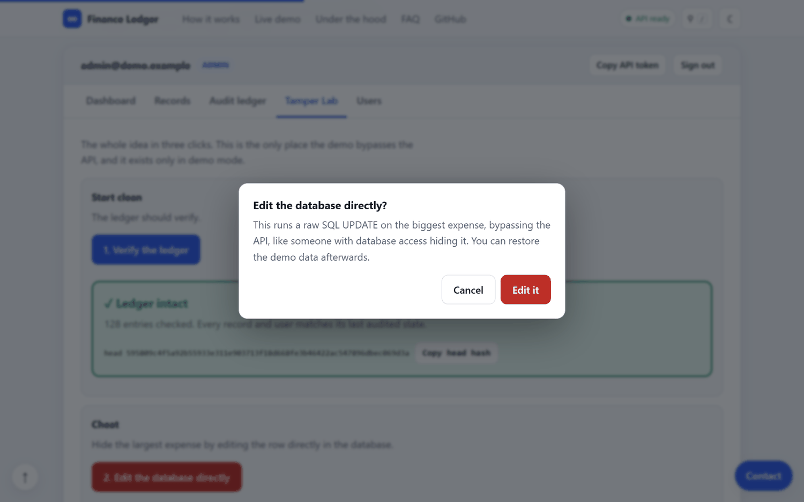<br><sub><b>Confirmation modals</b> before anything destructive.</sub></td>
<td>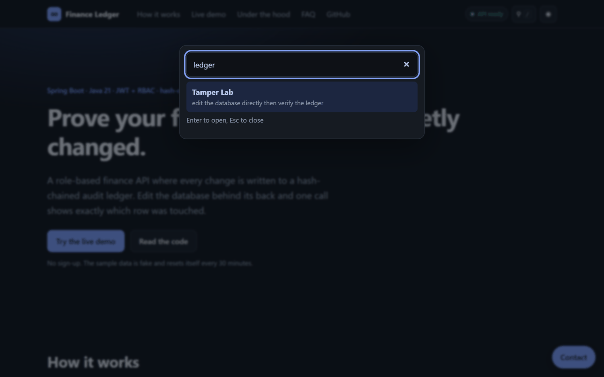<br><sub><b>Site search</b> (press <code>/</code>) across sections, FAQ and API endpoints.</sub></td>
</tr>
<tr>
<td colspan="2">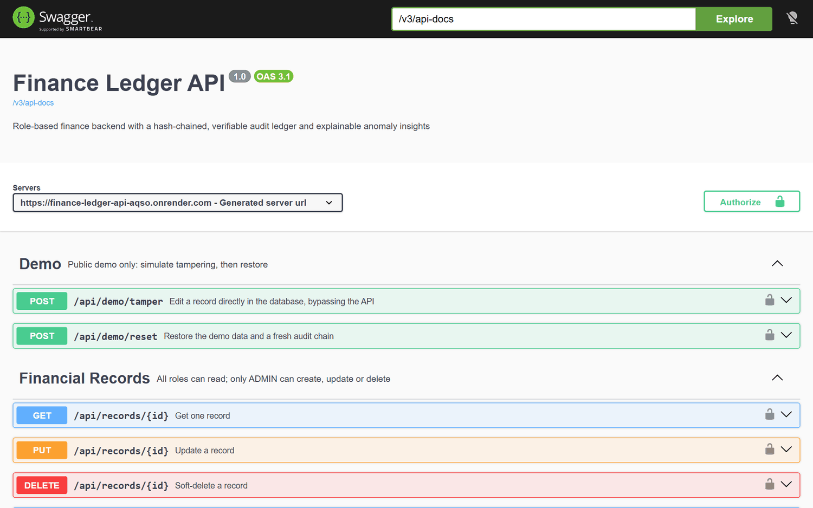<br><sub><b>Swagger UI</b> with bearer-token authorization for every endpoint.</sub></td>
</tr>
</table>

<div align="center">
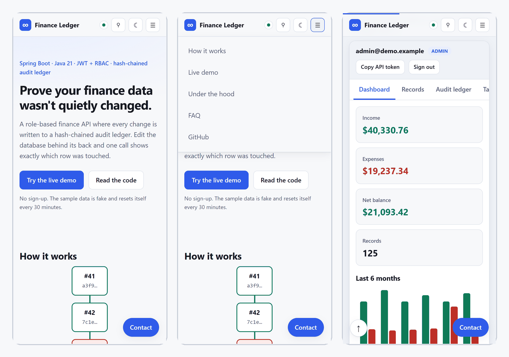
<br><sub>Responsive down to phone width.</sub>
</div>

## How it works

**A write.** The change and its audit entry commit together or not at all (`Propagation.MANDATORY`). Writers lock one chain-head row so concurrent requests cannot fork the chain.

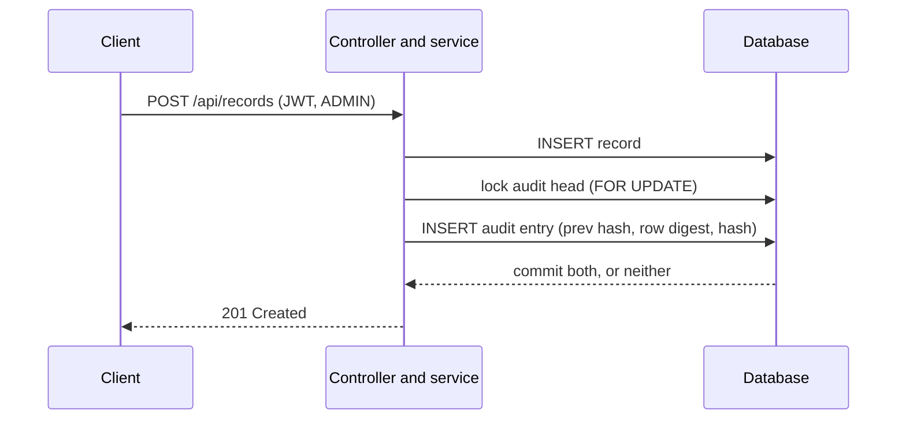

**A verification.** Two independent checks, because they catch different attacks.

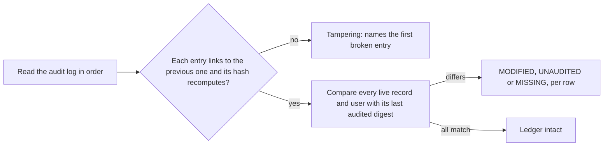

**The system.**

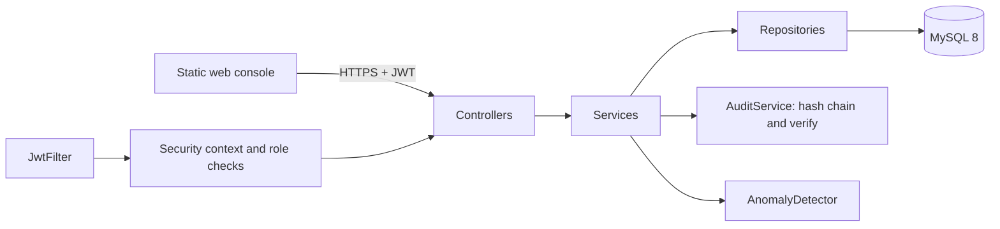

### What the ledger does not protect against

This is tamper-*evidence*, not tamper-proofing. Someone with full write access to the database who recomputes the entire chain consistently will produce a chain that verifies. To close that gap, record `headHash` (returned by `verify`) somewhere the database owner cannot edit, such as a periodic email, a signed commit, or an external timestamp service, and revoke `UPDATE`/`DELETE` on `audit_log` from the application's database user. The password hash and lockout counters are deliberately left out of the user digest because they change without an admin action.

### Anomaly detection

For each (type, category) with at least 5 records, a record is flagged when its **modified z-score** exceeds 3.5: `0.6745 * (x - median) / MAD` (Iglewicz and Hoaglin; 3.5 is their recommended cutoff). Median and MAD are used instead of mean and standard deviation because one huge outlier inflates the standard deviation enough to hide itself; a unit test shows a 1,000,000 outlier that mean/stddev cannot catch (for 7 samples its z-score can never exceed 2.27). If most amounts are identical (MAD = 0) it falls back to the mean absolute deviation with the standard 1.253314 factor. Categories are judged only against themselves, so rent is not compared with coffee. It is a heuristic for "look at this", not a fraud verdict.

## Engineering decisions

| Decision | Why |
|---|---|
| Hash chain plus **per-row digests**, not just a hash chain | A chain alone only protects the log. Storing each row's digest in the ledger is what lets `verify` catch a changed amount or role in the business tables. |
| No blockchain | One trusted writer needs tamper-evidence, not consensus. A hash chain is the smallest thing that gives it, and `headHash` can be anchored externally. |
| Median/MAD instead of mean/stddev | Robust to the very outliers it is looking for, and each flag can be explained in one sentence. |
| Roles read from the database on every request | Deactivating a user or changing a role takes effect immediately, with no token blacklist. The cost is one indexed lookup per request. |
| Flyway owns the schema, Hibernate runs in `validate` | Entity and schema drift fails at startup instead of silently altering tables. |
| Static front end plus API, split across hosts | The page loads instantly even while the free-tier API is asleep, and pre-warms it. |
| In-memory database for the public demo | Free hosting has no durable database. Seeding through the real services keeps the ledger consistent, and the demo resets itself. |

**Problems worth mentioning.** (1) Concurrent writers could have forked the chain: fixed with a single head-row lock and an 8-thread test that checks the chain stays linear. (2) A public demo with public passwords invites abuse: user management is read-only there, records are capped at 400, and lockout is off so strangers cannot lock the sample accounts. (3) The first admin used to require editing code: now it is created from environment variables on an empty database. (4) Driving the real UI in a browser found three bugs that unit tests could not: a restored session lost the demo flag, the confirm modal depended on a `close` event, and Escape in the search box only cleared the text.

## Public demo mode

`SPRING_PROFILES_ACTIVE=demo` (or `app.demo.enabled=true`) turns on a self-resetting sandbox. It is off by default and none of it is registered otherwise (a test checks that `/api/demo/*` returns 404).

- An in-memory database is seeded at start with six months of synthetic data, through the normal services, and reset every 30 minutes.
- `POST /api/demo/tamper` edits the largest expense with raw SQL, so the ledger can be shown catching it. `POST /api/demo/reset` restores everything.
- **Visits:** the page reports only the `utm_*` labels of a tagged link to `POST /api/public/visit`, which writes one log line. No cookies, no IP addresses, no identifiers, and a notice on the page lets visitors opt out. Use links like `.../?utm_source=resume&utm_campaign=<company>` to see which one was opened.

**Hosting.** The live demo runs the API as a Docker web service and `web/` as a static site on Render's free plan. Render's free Postgres expires after 30 days and allows one per workspace, which is why the demo uses the in-memory database. The same Flyway migration runs on MySQL 8 in Docker Compose and on H2 in the tests. For a persistent deployment, drop the demo profile and point `DB_URL` at a MySQL instance.

## Run it locally

**With Docker (MySQL 8):**

```bash
cp .env.example .env        # set DB_PASSWORD, JWT_SECRET (32+ chars), BOOTSTRAP_ADMIN_PASSWORD
docker compose up --build   # API on http://localhost:8080, Swagger at /swagger-ui/index.html
```

The first admin is created automatically on an empty database from `BOOTSTRAP_ADMIN_EMAIL` / `BOOTSTRAP_ADMIN_PASSWORD`. To use the web console against your local API, serve `web/` (for example `python -m http.server 5500 --directory web`), set `apiBase` in `web/config.js` to `http://localhost:8080`, and add `http://localhost:5500` to `CORS_ALLOWED_ORIGINS`.

**Without Docker:** Java 21, Maven and a MySQL 8 database, then set `DB_URL`, `DB_USERNAME`, `DB_PASSWORD`, `JWT_SECRET` and run `./mvnw spring-boot:run`. Configuration is environment-only; no secrets live in the repo.

**Tests:** `mvn verify` runs 65 tests on H2 in MySQL mode, using the same Flyway migration. They cover the full role matrix, 401/403/429 behavior, deactivated-token handling, validation and status codes, exact decimal totals (including a category with both income and expense), soft delete, every tampering scenario above, concurrent audit writes, the anomaly math, first-admin bootstrap, and the demo mode. CI runs this on every push. The app was also run end to end against MySQL 8 with Docker Compose to check the real migration and `validate` mode.

## Roles

Each cell is an automated test (`AccessControlTest.roleMatrix`).

| Action | Viewer | Analyst | Admin |
|---|:--:|:--:|:--:|
| List / read records, dashboard summary, monthly trends | yes | yes | yes |
| Anomaly insights, audit log, ledger verification | no | yes | yes |
| Create / update / delete records | no | no | yes |
| Manage users | no | no | yes |

## API

| Method | Path | Access |
|---|---|---|
| POST | `/api/auth/login` | public |
| GET | `/api/auth/me` | any signed-in user |
| POST, GET | `/api/users`, `/api/users/{id}` | Admin |
| PUT | `/api/users/{id}/activate`, `/deactivate` | Admin |
| DELETE | `/api/users/{id}` | Admin |
| POST, PUT, DELETE | `/api/records`, `/api/records/{id}` | Admin |
| GET | `/api/records`, `/api/records/{id}` | all roles |
| GET | `/api/dashboard/summary`, `/api/dashboard/trends` | all roles |
| GET | `/api/dashboard/insights` | Admin, Analyst |
| GET | `/api/audit`, `/api/audit/verify` | Admin, Analyst |
| GET, POST | `/api/public/config`, `/api/public/visit` | public |
| POST | `/api/demo/tamper`, `/api/demo/reset` | Admin, demo mode only |

`GET /api/records` takes `page`, `size` (1-100), `type`, `category`, `from`, `to`. Records are soft-deleted and listed newest first. Errors always use one JSON shape: `{"error": "...", "message": "...", "fieldErrors": {...}}`.

## Security notes

- JWT (HS256); the secret must be 32+ bytes or the app refuses to start. The token holds only the email; role and active flag come from the database on every request.
- Account lockout: 5 wrong passwords lock the account for 15 minutes (configurable), HTTP 429.
- Missing or bad token returns 401, missing permission returns 403, both as JSON.
- Passwords: BCrypt, 8-72 characters with upper, lower, digit and special character.
- CORS is off unless `CORS_ALLOWED_ORIGINS` is set. Set `DOCS_ENABLED=false` to hide Swagger in production.
- The web console renders all data with text nodes (never `innerHTML`), and ships a Content Security Policy that only allows its own scripts and the API origin.

## Limitations and what's next

**Known limitations.** No refresh tokens or logout/revocation list (deactivation is the revocation mechanism). Lockout is per account, not per IP, so it does not slow a credential-stuffing run across many accounts. Audit writes are serialized by one row lock (fine at this scale). `verify` and the monthly trends are full scans bounded by batch size, not incremental. The live demo's state is shared between visitors until the next reset.

**Next.**
- Signed, externally published checkpoints of `headHash`, and an alert when `verify` fails.
- Incremental verification from the last checkpoint.
- Refresh tokens with rotation, and a per-IP rate limit on login.
- A PostgreSQL profile alongside MySQL.

## License

MIT, see [LICENSE](LICENSE).
