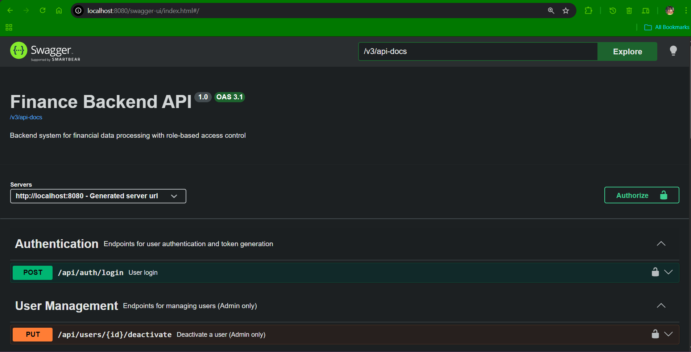
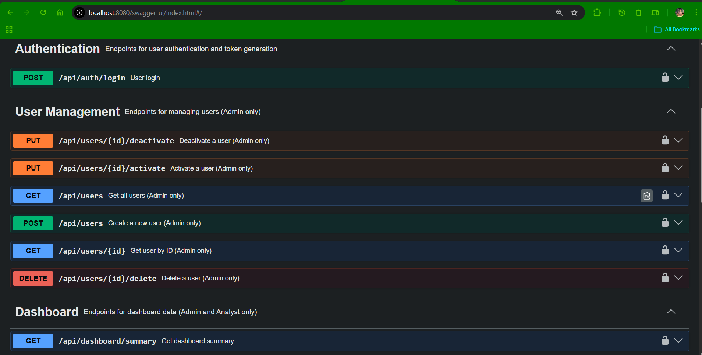
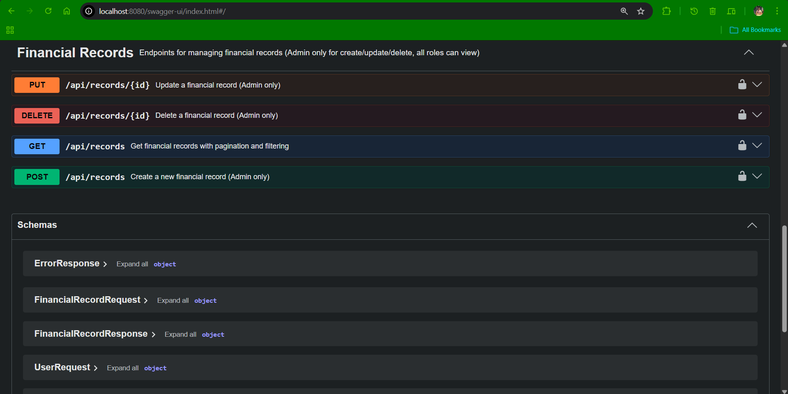
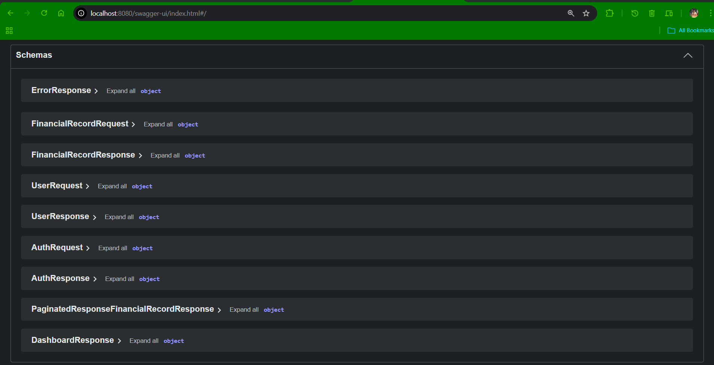

# Finance Data Processing & Access Control Backend

<div align="center">


**A production-ready backend system for financial data management with role-based access control**

[Features](#-features) • [Quick Start](#-quick-start) • [API Reference](#-api-reference) • [Architecture](#-architecture)

</div>

---

## 📋 Overview

This project implements a **Finance Dashboard Backend** that demonstrates enterprise-grade backend engineering practices. It provides secure APIs for managing financial records, user management, and dashboard analytics — all protected by JWT authentication and role-based access control (RBAC).

### What This Project Demonstrates

- **Clean Architecture** — Layered design with clear separation of concerns
- **Security First** — JWT authentication with BCrypt password hashing
- **Role-Based Access** — Granular permissions (Admin, Analyst, Viewer)
- **Data Integrity** — Soft deletes, ownership validation, audit trails
- **API Documentation** — Interactive Swagger UI with JWT support

---

## ✨ Features

### Core Functionality

| Feature | Description |
|---------|-------------|
| 🔐 **Authentication** | Stateless JWT-based authentication with configurable expiration |
| 👥 **User Management** | Create, activate/deactivate, and manage users (Admin only) |
| 💰 **Financial Records** | Full CRUD with soft delete, ownership tracking, and filtering |
| 📊 **Dashboard Analytics** | Real-time summaries: income, expenses, net balance, category breakdown |
| 🛡️ **Access Control** | Method-level security with Spring Security `@PreAuthorize` |

### Role Permissions Matrix

| Action | Viewer | Analyst | Admin |
|--------|:------:|:-------:|:-----:|
| View Dashboard | ✓ | ✓ | ✓ |
| View Records | ✓ | ✓ | ✓ |
| Create Records | ✗ | ✗ | ✓ |
| Update Records | ✗ | ✗ | ✓ |
| Delete Records | ✗ | ✗ | ✓ |
| Manage Users | ✗ | ✗ | ✓ |

---

## 🚀 Quick Start

### Prerequisites

- **Java 21** (LTS)
- **Maven 3.8+**
- **MySQL 8.0+**

### Setup

**1. Clone the repository**
```bash
git clone https://github.com/KUNALSHAWW/Finance-Data-Processing-and-Access-Control-Backend.git
cd Finance-Data-Processing-and-Access-Control-Backend
```

**2. Configure the database**

Copy the example properties file and update with your credentials:
```bash
cp src/main/resources/application-example.properties src/main/resources/application.properties
```

Edit `application.properties`:
```properties
spring.datasource.url=jdbc:mysql://localhost:3306/finance_db
spring.datasource.username=your_username
spring.datasource.password=your_password

# Use a strong secret key (minimum 32 characters)
app.jwt.secret=your_secure_random_secret_key_here_min_32_chars
app.jwt.expiration-ms=3600000
```

**3. Create the database**
```sql
CREATE DATABASE finance_db;
```

**4. Run the application**
```bash
./mvnw spring-boot:run
```

**5. Access Swagger UI**
```
http://localhost:8080/swagger-ui/index.html
```

---

## 🔑 Test Credentials

For testing purposes, create users via the API or use these sample credentials:

| Role | Email | Password |
|------|-------|----------|
| Admin | admin@test.com | Admin@test1234 |
| Analyst | analyst@test.com | Analyst@test1234 |
| Viewer | viewer@test.com | Viewer@test1234 |

> **Note:** First, create an admin user by temporarily removing `@PreAuthorize("hasRole('ADMIN')")` from the `createUser` endpoint, then re-enable it.

---

## 📖 API Reference

### Authentication
| Method | Endpoint | Description | Access |
|--------|----------|-------------|--------|
| POST | `/api/auth/login` | Authenticate and get JWT token | Public |

### User Management
| Method | Endpoint | Description | Access |
|--------|----------|-------------|--------|
| POST | `/api/users` | Create a new user | Admin |
| GET | `/api/users` | Get all users | Admin |
| GET | `/api/users/{id}` | Get user by ID | Admin |
| PUT | `/api/users/{id}/activate` | Activate user | Admin |
| PUT | `/api/users/{id}/deactivate` | Deactivate user | Admin |
| DELETE | `/api/users/{id}` | Delete user | Admin |

### Financial Records
| Method | Endpoint | Description | Access |
|--------|----------|-------------|--------|
| POST | `/api/records` | Create record | Admin |
| GET | `/api/records` | List records (paginated) | All |
| PUT | `/api/records/{id}` | Update record | Admin |
| DELETE | `/api/records/{id}` | Soft delete record | Admin |

**Query Parameters for GET /api/records:**
- `page` (default: 0) — Page number
- `size` (default: 5) — Records per page
- `type` (optional) — Filter by INCOME or EXPENSE

### Dashboard
| Method | Endpoint | Description | Access |
|--------|----------|-------------|--------|
| GET | `/api/dashboard/summary` | Get financial summary | Admin, Analyst |

### Response Codes
| Code | Meaning |
|------|---------|
| 200 | Success |
| 201 | Created |
| 400 | Bad Request (validation error) |
| 401 | Unauthorized (invalid/missing token) |
| 403 | Forbidden (insufficient permissions) |
| 404 | Resource Not Found |
| 409 | Conflict (e.g., duplicate email) |
| 500 | Internal Server Error |

---

## 🏗️ Architecture

### Project Structure

```
src/main/java/com/kunal/finance/backend/
├── config/           # Security, Swagger, and app configuration
├── controller/       # REST API endpoints
├── dto/              # Request/Response data transfer objects
├── entity/           # JPA entities (User, FinancialRecord)
├── exception/        # Custom exceptions and global handler
├── repository/       # Spring Data JPA repositories
├── security/         # JWT filter, UserDetailsService
└── service/          # Business logic layer
```

### Data Flow

```
Client Request
      ↓
[JWT Filter] ─── validates token ─── [SecurityContext]
      ↓
[Controller] ─── @PreAuthorize ─── role check
      ↓
[Service Layer] ─── business logic + validation
      ↓
[Repository] ─── JPA/Hibernate
      ↓
[MySQL Database]
```

### Entity Relationships

```
┌─────────────┐         ┌───────────────────┐
│    User     │ 1 ──── * │  FinancialRecord  │
├─────────────┤         ├───────────────────┤
│ id          │         │ id                │
│ name        │         │ amount            │
│ email       │         │ type (ENUM)       │
│ password    │         │ category          │
│ role (ENUM) │         │ description       │
│ active      │         │ createdAt         │
└─────────────┘         │ deleted           │
                        │ deletedAt         │
                        │ createdBy (FK)    │
                        └───────────────────┘
```

---

## 🔧 Technical Decisions

### Why These Choices?

| Decision | Rationale |
|----------|-----------|
| **Spring Boot 3.5** | Latest stable with Java 21 support, virtual threads ready |
| **JWT over Sessions** | Stateless, scalable, frontend-friendly |
| **BCrypt** | Industry-standard password hashing with built-in salt |
| **Soft Deletes** | Preserve audit trails, enable data recovery |
| **MySQL** | ACID compliance, widely deployed, great tooling |
| **Swagger/OpenAPI** | Self-documenting APIs, testable via browser |

### Assumptions Made

1. **Single-tenant system** — All users share the same data space
2. **Record ownership** — Only the creator (admin) can update their records
3. **No registration endpoint** — Users are created by admins only
4. **Category is free-text** — Not enum-based, for flexibility

---

## 📸 Screenshots

### Swagger UI


### API Endpoints



### Schemas


---

## 🧪 Testing

### Postman Collection

Import the collection from `postman_collection/` folder for ready-to-use API tests.

### Manual Testing Flow

1. **Login** → Get JWT token from `/api/auth/login`
2. **Authorize** → Click "Authorize" in Swagger UI, paste `Bearer <token>`
3. **Test Endpoints** → Try creating records, viewing dashboard, etc.

---

## 📁 Key Files

| File | Purpose |
|------|---------|
| `SecurityConfig.java` | HTTP security, JWT filter chain, CSRF config |
| `JwtFilter.java` | Extracts and validates JWT from requests |
| `GlobalExceptionHandler.java` | Centralized error handling |
| `FinancialRecordServiceImpl.java` | Core business logic for records |
| `DashboardServiceImpl.java` | Aggregation logic for summaries |

---

## 🚧 Future Improvements

- [ ] Add refresh token mechanism
- [ ] Implement rate limiting on login endpoint
- [ ] Database-level aggregation queries for dashboard (performance)
- [ ] Add unit and integration tests
- [ ] Docker containerization
- [ ] API versioning

---

## 👨‍💻 Author

**Kunal Kumar Shaw**  
📧 kunalshawkol17@gmail.com

---

## 📄 License

This project is open source and available under the [MIT License](LICENSE).

---

<div align="center">
<i>Built with ❤️ using Spring Boot</i>
</div>
